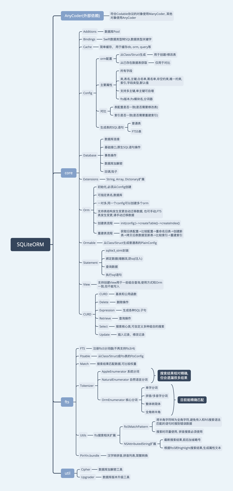

# SQLiteORM

[](https://cocoapods.org/pods/SQLiteORM)
[](https://cocoapods.org/pods/SQLiteORM)
[](https://cocoapods.org/pods/SQLiteORM)

## 改动(0.2.1)
1. 修复64位Int类型绑定导致闪退的问题。

## 功能
* [x] 根据Class/Struct生成数据表
* [x] 增删改查,insert,update,upsert,delele,drop...
* [x] 扩展String, 用于生产Where语句,可满足大部分常规场景
* [x] 数据库加解密(SQLCipher)
* [x] 原生SQL语句支持
* [x] 常规查询函数支持,max(),min(),sum(),count()...
* [x] 支持主键,可多主键,单主键可自增.
* [x] 支持唯一性约束
* [x] Transaction支持
* [x] Object直接处理
* [x] 数据存储,Swift类型支持: String, Int, UInt, Data, NSString, NSNumber ...
* [x] 子对象存储为Json字符串
* [x] 查询缓存
* [x] FTS5全文搜索(不支持FTS3/4)
* [x] 自定义FTS分词器
* [x] 支持拼音分词,简繁互搜
* [x] 支持外键,约束
* [x] 支持View

## 结构


## 安装
```ruby
pod 'SQLiteORM', '~> 0.1.8'
```
使用测试版本:
```ruby
pod 'SQLiteORM', :git => 'https://github.com/pozi119/SQLiteORM.git'
```
## 注意
1. 子对象会保存成为Json字符串,子对象内的Data/NSData也会保存为16进制字符串.

## 用法
此处主要列出一些基本用法,详细用法请阅读代码注释.

### 打开/创建数据库文件
```swift
let db = Database(with: path)
```

### 定义ORM配置
1. 手动创建`PlainConfig` / `FtsConfig`.
2. 普通表适配协议`Ormable`, fts表适配协议`Ftsable`

**注意:** 已移除fts3/4的支持,仅使用fts5

### 定义ORM模型 
可自定义表名和存放的数据库文件.
**注意:** SQL关键字不能用于表名

示例如下:

```swift
let groupOrm = Orm(ormable: Group.self, db: db, table: "xgroup")        
```

### 增删改查
使用ORM模型进行增删改查等操作.

示例如下:

```swift
let total = groupOrm.count()

let groups = groupOrm.find().where {
        fetch.name.length > 0 ? E.name.like(fetch.name) : ""
    }.orderBy {
        fetch.collation == .addFirst ? E.createAt.desc : E.updateAt.desc
    }.offset {
        max(fetch.current - 1, 0) * fetch.size
    }.limit {
        fetch.size
    }.allItems()

let groups = groupOrm.find().where { E.id.in(ids) }.allItems()

let ret = groupOrm.update(with: [E.name: name, E.updateAt: now]) { E.id |== id }
...
```

### 生成SQL子句
1. 为 String 扩展了一些运算符
```swift
infix operator |==: ComparisonPrecedence // ==
infix operator |!=: ComparisonPrecedence // !=
infix operator |>: ComparisonPrecedence // >
infix operator |>=: ComparisonPrecedence // >=
infix operator |<: ComparisonPrecedence // <
infix operator |<=: ComparisonPrecedence // <=
infix operator |!>: ComparisonPrecedence // !>
infix operator |!<: ComparisonPrecedence // !<
infix operator |<>: ComparisonPrecedence // <>

infix operator |&&: LogicalConjunctionPrecedence // &&
infix operator |||: LogicalConjunctionPrecedence // ||

postfix operator ↑
postfix operator ↓
```
示例: 
```swift
func testWhereLogic() {
    let w1 = "name" |== "zhangsan"
    let w2 = "age" |== 22
    let w3 = w1 |&& w2
    let w4 = w3 ||| "age" |== 21
    let w5 = w4 |&& "name" |== "lisi"
    let w6 = w5 ||| "age" |== 20
    XCTAssertEqual(w1, "\"name\" == \"zhangsan\"")
    XCTAssertEqual(w2, "\"age\" == 22")
    XCTAssertEqual(w3, "(\"name\" == \"zhangsan\") AND (\"age\" == 22)")
    XCTAssertEqual(w4, "((\"name\" == \"zhangsan\") AND (\"age\" == 22)) OR (\"age\" == 21)")
    XCTAssertEqual(w5, "(((\"name\" == \"zhangsan\") AND (\"age\" == 22)) OR (\"age\" == 21)) AND (\"name\" == \"lisi\")")
    XCTAssertEqual(w6, "((((\"name\" == \"zhangsan\") AND (\"age\" == 22)) OR (\"age\" == 21)) AND (\"name\" == \"lisi\")) OR (\"age\" == 20)")
}
```

2. 为 String 添加了一些计算属性
比如: `asc` `desc`

3. 为 String 添加了一些函数
比如: `like` `glob` `in` `between`

示例:
```swift
func testWhereExp() {
    let v1 = "age".like(22)
    let v2 = "age".notLike(22)
    let v3 = "age".match(22)
    let v4 = "age".glob(22)
    let v5 = "age".notGlob(22)
    let v6 = "age".is(22)
    let v7 = "age".isNot(22)
    let v8 = "age".exists(22)
    let v9 = "age".notExists(22)
    let v10 = "age".isNull()
    let v11 = "age".between((20, 30))
    let v12 = "age".notBetween((20, 30))
    let v13 = "age".in([21, 22, 25, 28])
    let v14 = "age".notIn([21, 22, 25, 28])
    XCTAssertEqual(v1, "\"age\" LIKE \"%22%\"")
    XCTAssertEqual(v2, "\"age\" NOT LIKE \"%22%\"")
    XCTAssertEqual(v3, "\"age\" MATCH 22")
    XCTAssertEqual(v4, "\"age\" GLOB \"*22*\"")
    XCTAssertEqual(v5, "\"age\" NOT GLOB \"*22*\"")
    XCTAssertEqual(v6, "\"age\" IS 22")
    XCTAssertEqual(v7, "\"age\" IS NOT 22")
    XCTAssertEqual(v8, "\"age\" EXISTS 22")
    XCTAssertEqual(v9, "\"age\" NOT EXISTS 22")
    XCTAssertEqual(v10, "\"age\" IS NULL")
    XCTAssertEqual(v11, "\"age\" BETWEEN 20 AND 30")
    XCTAssertEqual(v12, "\"age\" NOT BETWEEN 20 AND 30")
    XCTAssertEqual(v13, "\"age\" IN (21,22,25,28)")
    XCTAssertEqual(v14, "\"age\" NOT IN (21,22,25,28)")
}
```

### 原生语句查询
```
db.query("SELECT * FROM 'xgroup';")
db.excute("UPDATE xgroup SET 'name' = '分组1' WHERE 'id' = 1;")
```

## Author

Valo Lee, pozi119@163.com

## License

SQLiteORM is available under the MIT license. See the LICENSE file for more info.
